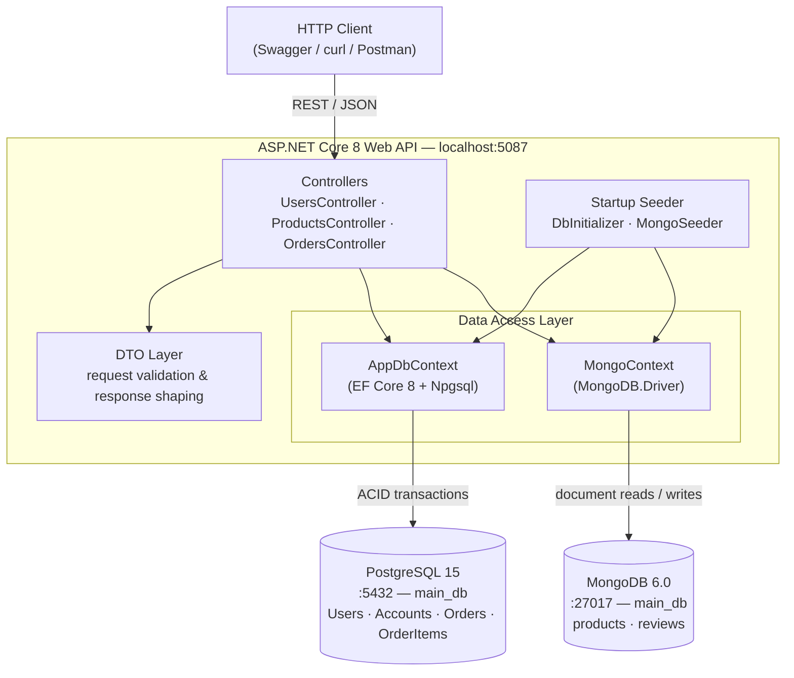
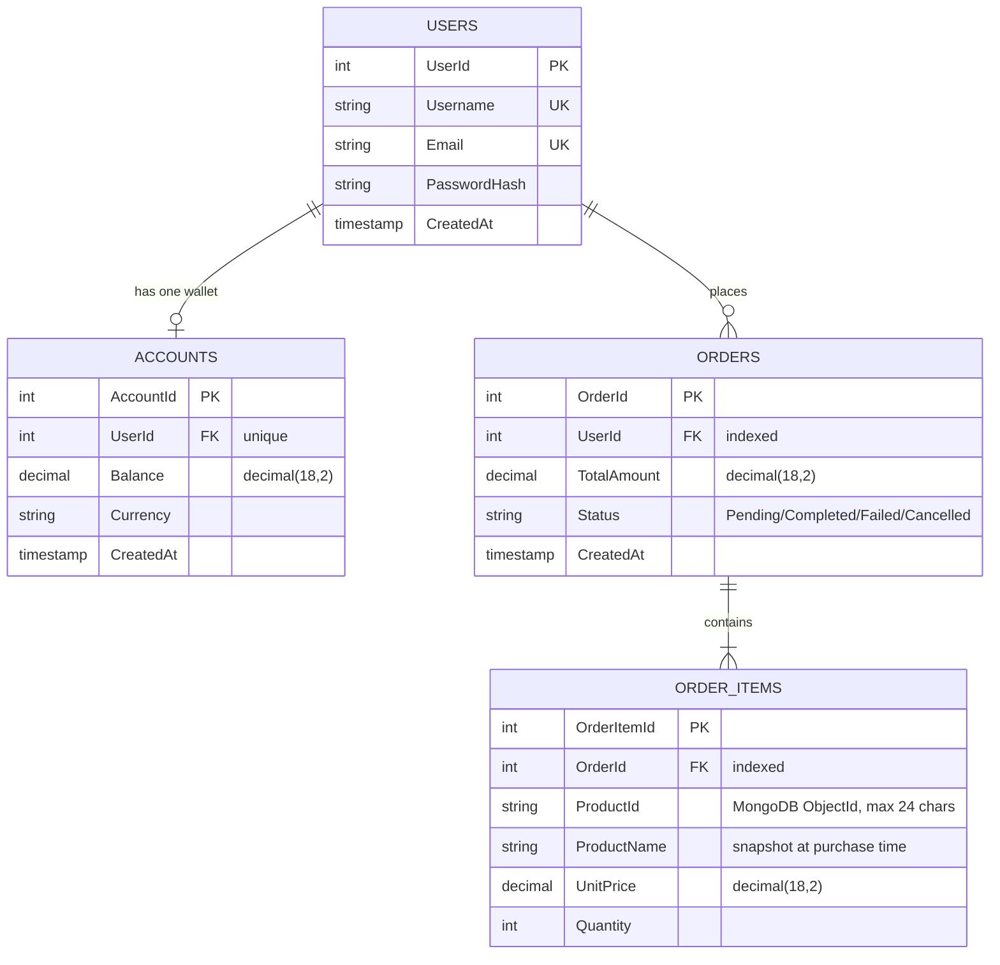
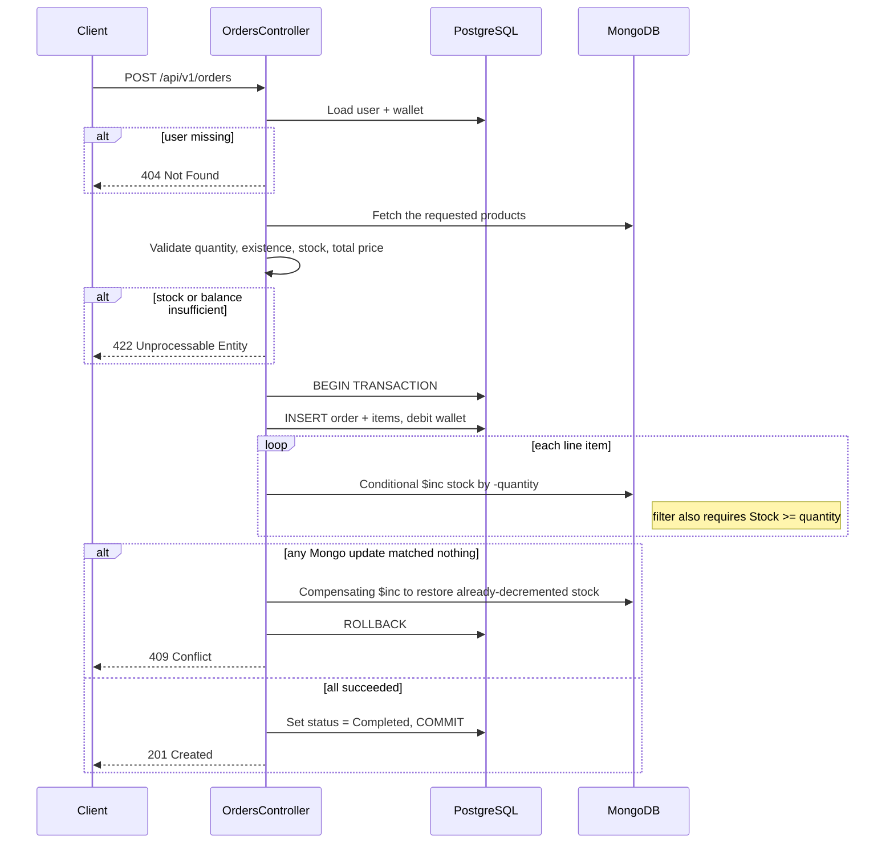

# GAMIQ — Digital Game Marketplace API

**269340: Data Centric Application Development (2026) — Team Project Checkpoint 1**
Department of Computer Engineering, Faculty of Engineering, Chiang Mai University

A dual-database backend for a digital game marketplace, built with ASP.NET Core 8 (Web API).
PostgreSQL holds the transactional core (users, wallets, orders); MongoDB holds the flexible
product catalog and user reviews.

---

## 1. Team Roster

| Student ID | Name | Responsibilities |
|---|---|---|
| 670615028 | Pitikan Kanjanasiri | API layer, business logic, controller design, request validation, order workflow rules |
| 670615021 | Yanisa Khankhumnanta | PostgreSQL schema design, EF Core configuration, migrations, transactional database management |
| 670615023 | Natthawan Saengsrichan | MongoDB design, product catalog structure, seed scripts, documentation |

---

## 2. Quick Start

### Prerequisites

| Tool | Version |
|---|---|
| Docker Desktop (or Docker Engine + Compose v2) | 20.10+ |
| .NET SDK | 8.0+ |

Ports **5432**, **27017** and **5087** must be free on the host machine.

### Step 1 — Start both databases

From the repository root:

```bash
docker compose up -d
```

Verify that both containers are healthy:

```bash
docker compose ps
```

Expected output: `gamiq_postgres` and `gamiq_mongo`, both `running (healthy)`.

### Step 2 — Configure credentials

Copy the example environment file and adjust it if you changed anything in `docker-compose.yml`:

```bash
cp .env.example .env
```

The defaults match the Compose file, so no edits are needed for a local run. `Program.cs` loads
`.env` at startup (walking up from the current directory), so this file must sit at the repository
root — no extra NuGet package or manual `export` is required.

### Step 3 — Run the API

```bash
cd src/GAMIQ.Api
dotnet restore
dotnet run
```

On the first start the application will automatically:

1. Apply the EF Core migration (`InitialCreate`) to PostgreSQL.
2. Seed MongoDB with **1,200 products** and **1,200 reviews**.
3. Seed PostgreSQL with **1,000 users**, **1,000 accounts**, **400 orders** and **~800 order items**.

Seeding is idempotent — it is skipped if the databases already contain data, so restarting the
API is safe.

### Step 4 — Open the API

| What | URL |
|---|---|
| Swagger UI | http://localhost:5087/swagger |
| API base | http://localhost:5087/api/v1 |

### Resetting to a clean state

```bash
docker compose down -v   # -v removes the volumes, wiping all seeded data
docker compose up -d
```

---

## 3. System Architecture



The backend is organised into three layers:

1. **API layer** — handles HTTP requests, validation and status codes.
2. **Data layer** — connects to PostgreSQL through EF Core and to MongoDB through the official driver.
3. **Data initialization layer** — seeds both databases with realistic sample records at startup.

Both database engines run as containers defined in `docker-compose.yml`, each with a named volume
for persistence and a healthcheck so that startup order is predictable.

---

## 4. Data Model

### 4.1 PostgreSQL — transactional core



PostgreSQL was chosen for this data because balances, orders and their line items require
referential integrity and ACID guarantees. Each user owns exactly one wallet account
(enforced by a unique index on `Accounts.UserId`); orders use `DeleteBehavior.Restrict` so a user
with purchase history cannot be silently deleted, while order items cascade with their parent order.

**Cross-database link.** `OrderItems.ProductId` stores the MongoDB `ObjectId` of the purchased
product. `ProductName` and `UnitPrice` are deliberately *denormalised snapshots* taken at purchase
time, because the MongoDB document can be renamed or repriced later and historical orders must
remain accurate.

### 4.2 MongoDB — flexible catalog

**`products` collection**

```json
{
  "_id": "ObjectId",
  "Name": "Ergonomic Firewall: Handcrafted Steel Chair",
  "Description": "...",
  "Price": 29.99,
  "Stock": 143,
  "Genres": ["RPG", "Strategy"],
  "Platforms": ["Windows", "NintendoSwitch"],
  "Tags": ["Co-op", "Open World"],
  "Attributes": {
    "developer": "Kunde Group",
    "publisher": "Hirthe Inc",
    "releaseYear": 2021,
    "ageRating": "M",
    "discountPercent": 40
  },
  "CreatedAt": "2024-05-11T08:22:41Z"
}
```

**`reviews` collection**

```json
{
  "_id": "ObjectId",
  "ProductId": "ObjectId of the product",
  "UserId": 472,
  "Rating": 4,
  "Comment": "...",
  "PlaytimeHours": 87.5,
  "Metadata": {
    "platform": "PlayStation5",
    "patchVersion": "3.12.7",
    "verifiedPurchase": true
  },
  "CreatedAt": "2025-02-03T19:44:02Z"
}
```

MongoDB was chosen here because games carry wildly varying descriptive data — a strategy title and
a VR racing title share almost no optional fields. The `Attributes` and `Metadata` sub-documents
are open-ended maps, so new fields can be added without a migration. Reviews are semi-structured,
high-volume and never participate in financial transactions, which makes them a natural document
workload.

### 4.3 Why split the data this way

| Question | PostgreSQL | MongoDB |
|---|---|---|
| Must it be consistent to the cent? | Yes | No |
| Is the shape fixed and known in advance? | Yes | No |
| Does it join to other entities? | Heavily | Rarely |
| Write volume | Moderate | High |

Money, ownership and order history go to PostgreSQL. Descriptive, user-generated and
schema-varying data goes to MongoDB.

---

## 5. REST API Reference

Base URL: `http://localhost:5087/api/v1`

| Method | Route | Description | Database |
|---|---|---|---|
| `POST` | `/users` | Create a user account (auto-creates a wallet with 0 balance) | PostgreSQL |
| `GET` | `/users/{id}` | Fetch user details including wallet balance | PostgreSQL |
| `GET` | `/products?page=1&pageSize=20` | Fetch the paginated catalog | MongoDB |
| `POST` | `/products` | Create a product with dynamic attributes | MongoDB |
| `POST` | `/orders` | Create an order — debits the wallet and decrements stock | PostgreSQL + MongoDB |
| `GET` | `/orders/{id}` | Fetch an order with its line items | PostgreSQL |

### Status codes

| Code | Meaning in this API |
|---|---|
| `200 OK` | Successful retrieval |
| `201 Created` | Resource created; `Location` header points at the new resource |
| `400 Bad Request` | Missing required fields, negative price, non-positive quantity |
| `404 Not Found` | User, product or order does not exist |
| `409 Conflict` | Duplicate username/email, or a concurrent-purchase stock conflict |
| `422 Unprocessable Entity` | Business rule violation — insufficient stock or insufficient balance |

### Example requests

Create a user:

```bash
curl -i -X POST http://localhost:5087/api/v1/users \
  -H "Content-Type: application/json" \
  -d '{"username":"somchai01","email":"somchai@example.com","password":"Passw0rd!"}'
```

Browse the catalog:

```bash
curl "http://localhost:5087/api/v1/products?page=1&pageSize=5"
```

Create a product with dynamic attributes:

```bash
curl -i -X POST http://localhost:5087/api/v1/products \
  -H "Content-Type: application/json" \
  -d '{
        "name": "Chiang Mai Drift",
        "description": "Street racing through the old city.",
        "price": 19.99,
        "stock": 250,
        "genres": ["Racing", "Indie"],
        "platforms": ["Windows", "PlayStation5"],
        "tags": ["Singleplayer", "Controller Support"],
        "attributes": { "developer": "CMU Studio", "releaseYear": 2026, "ageRating": "E" }
      }'
```

Place an order (use a real `productId` from the catalog response, and a user whose wallet has
enough balance — the seeded users all have a random balance between 0 and 5,000 THB):

```bash
curl -i -X POST http://localhost:5087/api/v1/orders \
  -H "Content-Type: application/json" \
  -d '{
        "userId": 1,
        "items": [{ "productId": "<paste an ObjectId here>", "quantity": 2 }]
      }'
```

Ready-to-run versions of these requests are in `src/GAMIQ.Api/GAMIQ.Api.http`.

---

## 6. The Dual-Database Order Transaction

`POST /api/v1/orders` is the only endpoint that writes to both engines, so it is the most
interesting part of the system.



**Design notes**

- Validation happens *before* the transaction opens, so the PostgreSQL transaction is held for the
  shortest possible time.
- The MongoDB stock update is conditional: the filter requires `Stock >= quantity`, so two
  simultaneous buyers cannot drive stock negative. If the filter matches nothing, `ModifiedCount`
  is 0 and the order is aborted.
- PostgreSQL and MongoDB cannot share a single distributed transaction, so the MongoDB side is
  undone with an explicit **compensating action** (`OrdersController.CompensateStockAsync`) rather
  than a rollback: every stock decrement that already succeeded for this order is reversed with a
  matching `$inc` before the PostgreSQL transaction rolls back.

### Known limitation

The compensating write can itself fail (for example if MongoDB becomes unreachable mid-order),
which would leave stock under-counted while the PostgreSQL order is correctly rolled back. A
production system would make this durable with an outbox table and a background reconciler, or
adopt a full saga pattern with a persisted compensation log. That is out of scope for Checkpoint 1
and is documented here as a deliberate, understood trade-off.

---

## 7. Seed Data

Seeding runs automatically at startup and uses [Bogus](https://github.com/bchalk101/Bogus) with a
fixed randomizer seed (`42`), so every team member and the evaluator get identical data.

| Database | Collection / Table | Records |
|---|---|---|
| PostgreSQL | `Users` | 1,000 |
| PostgreSQL | `Accounts` | 1,000 |
| PostgreSQL | `Orders` | 400 |
| PostgreSQL | `OrderItems` | ~800 |
| PostgreSQL | **Total** | **~3,200** |
| MongoDB | `products` | 1,200 |
| MongoDB | `reviews` | 1,200 |
| MongoDB | **Total** | **2,400** |

Seed passwords are hashed with ASP.NET Core Identity's `PasswordHasher`; no plaintext password is
ever stored. Every seeded user shares the password `Passw0rd!` for testing convenience.

Source files:

- `src/GAMIQ.Api/Data/DbInitializer.cs` — PostgreSQL
- `src/GAMIQ.Api/Data/Mongo/MongoSeeder.cs` — MongoDB

---

## 8. Repository Structure

```
.
├── docker-compose.yml              # PostgreSQL 15 + MongoDB 6.0 with volumes & healthchecks
├── .env.example                    # Template for local credentials (no secrets committed)
├── .gitignore
├── GAMIQ.slnx
├── README.md
└── src/
    └── GAMIQ.Api/
        ├── Program.cs              # DI registration, .env loading, seeding, middleware pipeline
        ├── GAMIQ.Api.csproj
        ├── GAMIQ.Api.http          # Sample requests for every endpoint
        ├── appsettings.json        # No secrets — values come from environment variables
        ├── Controllers/
        │   ├── UsersController.cs
        │   ├── ProductsController.cs
        │   └── OrdersController.cs # Includes the CompensateStockAsync rollback helper
        ├── Data/
        │   ├── AppDbContext.cs     # EF Core model configuration (keys, FKs, indices)
        │   ├── DbInitializer.cs    # PostgreSQL migration + seed
        │   └── Mongo/
        │       ├── MongoContext.cs
        │       └── MongoSeeder.cs
        ├── Dtos/                   # Request/response contracts
        ├── Models/
        │   ├── Postgres/           # User, Account, Order, OrderItem
        │   └── Mongo/              # Product, Review
        └── Migrations/             # EF Core migration history
```

---

## 9. Configuration

No connection strings or passwords are stored in `appsettings.json`. `Program.cs` looks for a
`.env` file (starting in the current working directory and walking up to five parent directories,
so it is found whether you run `dotnet run` from the repo root or from `src/GAMIQ.Api`), loads each
`KEY=VALUE` line into the process environment, and ASP.NET Core's built-in environment-variable
configuration provider then maps double-underscore keys onto the corresponding settings.

Copy `.env.example` to `.env` and adjust as needed:

```dotenv
POSTGRES_DB=main_db
POSTGRES_USER=dev_user
POSTGRES_PASSWORD=dev_password
ConnectionStrings__Postgres=Host=localhost;Port=5432;Database=main_db;Username=dev_user;Password=dev_password
MongoDb__ConnectionString=mongodb://localhost:27017
MongoDb__DatabaseName=main_db
```

`.env` is listed in `.gitignore` and is never committed. If `.env` is missing, the API fails fast
on startup with a clear `InvalidOperationException` telling you to copy `.env.example`, rather than
a cryptic Npgsql connection error.

---

## 10. Troubleshooting

| Symptom | Cause | Fix |
|---|---|---|
| `ConnectionStrings:Postgres is not set` on startup | `.env` was never created | `cp .env.example .env` at the repo root |
| `Npgsql...connection refused` on startup | Containers not up yet | `docker compose ps`, wait for `healthy`, then `dotnet run` again |
| Port 5432 or 27017 already allocated | A local PostgreSQL/MongoDB is running | Stop the local service, or change the host port in `docker-compose.yml` |
| Seeding is skipped and tables are empty | Volumes hold a partially seeded state | `docker compose down -v && docker compose up -d` |
| `dotnet run` fails on SDK version | Only a newer shared runtime is installed | Already handled by `<RollForward>LatestMajor</RollForward>` in the `.csproj` |
| Swagger returns 404 | Not running in the Development environment | `export ASPNETCORE_ENVIRONMENT=Development` before `dotnet run` |

---

## 11. Checkpoint 1 Deliverables

| Requirement | Where it lives |
|---|---|
| Root `docker-compose.yml` launching both engines | `./docker-compose.yml` |
| Working .NET 8 / EF Core backend | `./src/GAMIQ.Api/` |
| DDL scripts or EF Core migration history | `./src/GAMIQ.Api/Migrations/` |
| Seed scripts with 1,000+ records per database | `DbInitializer.cs`, `MongoSeeder.cs` — see §7 |
| README with setup, team roster, architecture diagram | This file — §1, §2, §3 |
| ≥3 normalized PostgreSQL tables with PK/FK/indices | §4.1 |
| ≥2 MongoDB collections with flexible documents | §4.2 |
| Baseline REST endpoints | §5 |
| No secrets committed to Git | §9 |
| Clean Git history with balanced contributions | `git log --oneline --graph` |
